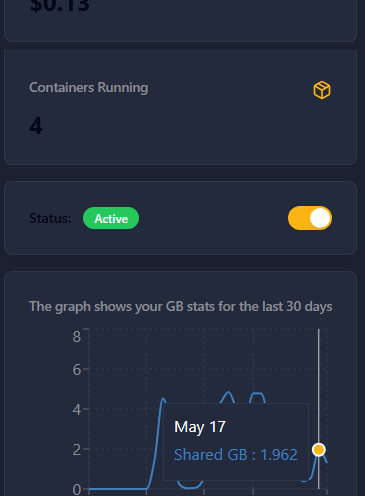

<h1 align="center">HoneyGainLegitFarm</h1>



<p align="center">
Automatize downloads legítimos de Steam e vídeos do YouTube para gerar tráfego de dados contínuo e maximizar seus ganhos no Honeygain</p>

<p align="center"><code>docker pull mediacutstudio/honeygainclaimpotautomation</code></p>
<p align="center"><code>docker pull mediacutstudio/ytdownloadautomation</code></p>


<details>
<summary><strong>Table of contents</strong></summary>

<!-- Begin ToC -->
- [Descrição](#descrição)
- [Pré-requisitos](#pré-requisitos)
- [Instalação](#instalação)
- [Configuração](#configuração)
- [Uso](#uso)
- [Demonstrativo de Métricas](#demonstrativo-de-métricas)
- [Boas práticas](#boas-práticas)
- [Containerização](#containerização)
- [Contribuindo](#contribuindo)
<!-- End ToC -->

</details>

# 
O **Legit Farm** é uma automação que gera tráfego de dados verdadeiro através de ciclos de download:
- Uso de `steamcmd` para instalar/atualizar jogos gratuitos (ex.: App ID `480`).
- Uso de `yt-dlp` para baixar vídeos do YouTube.

Esse tráfego legítimo é consumido pelo aplicativo Honeygain, aumentando de forma contínua seus créditos sem violar os termos de uso.

## Demonstrativo de Métricas

| Ciclo | Tráfego Steam | Vídeos YouTube | Total (GB) | Ganho Estimado |
|-------|---------------|----------------|------------|----------------|
| 1     | ~5 GB         | ~1 GB          | ~6 GB      | ~0,12 USD      |
| 2     | ~5 GB         | ~1 GB          | ~6 GB      | ~0,12 USD      |
| 3     | ~5 GB         | ~1 GB          | ~6 GB      | ~0,12 USD      |
|**Total Diário**|           |                | **~18 GB** | **~0,36 USD**  |

> Esses valores são aproximados e variam conforme a qualidade do vídeo e atualizações do Steam. Ajuste o número de ciclos para aumentar seu rendimento.

## Pré-requisitos

- Python 3.8 ou superior
- [SteamCMD](https://developer.valvesoftware.com/wiki/SteamCMD) instalado e configurado
- [yt-dlp](https://github.com/yt-dlp/yt-dlp) instalado (`pip install yt-dlp`)
- Conta no [Honeygain](https://honeygain.com/) instalada e em execução
- Conexão de Internet estável

## Instalação

1. Clone este repositório:
   ```bash
   git clone https://github.com/seu-usuario/legit-farm-honeygain.git
   cd legit-farm-honeygain
   ```
2. (Opcional) Crie e ative um ambiente virtual:
   ```bash
   python3 -m venv venv
   source venv/bin/activate  # Linux/macOS
   venv\Scripts\activate     # Windows
   ```
3. Instale `yt-dlp`:
   ```bash
   pip install yt-dlp
   ```

## Configuração

- Baixe ou posicione seu arquivo de credenciais do Firebase (serviceAccountKey JSON) em `Keys/firebase.json`.
- Crie ou atualize `Keys/keys.env` com as variáveis abaixo:

  ```ini
  STEAM_USERNAME=seu_usuario_steam
  STEAM_PASSWORD=sua_senha_steam
  STEAM_APP_ID=480
  STEAM_INSTALL_DIR=/caminho/para/steam_apps/480
  STEAMCMD_PATH=/caminho/para/steamcmd
  VIDEO_FILE=yts.txt
  YT_OUTPUT=yt_downloads
  CYCLE_INTERVAL=1800
  LOG_FILE=automation.log
  firebase_json_path=./Keys/firebase.json
  firebase_db_url=https://SEU_PROJETO.firebaseio.com
  ```

## Uso

Configure suas credenciais e parâmetros em `Keys/keys.env`, depois execute:

```bash
python automation.py
```

O script roda ciclos de download de Steam e YouTube continuamente até ser interrompido (Ctrl+C).

Para visualizar métricas em tempo real, inicie o dashboard:

```bash
python app.py
```

Abra no navegador: http://localhost:5010

### Argumentos

- `--username`: Usuário Steam (obrigatório)
- `--password`: Senha Steam (obrigatório)
- `--app-id`: ID do aplicativo Steam (ex.: `480` para Spacewar) (obrigatório)
- `--install-dir`: Diretório de instalação do Steam (obrigatório)
- `--video-file`: Arquivo texto com URLs do YouTube (obrigatório)
- `--yt-output`: Pasta de saída para downloads de vídeo (padrão: `yt_downloads`)
- `--steamcmd-path`: Caminho para o executável `steamcmd` (remova se estiver no PATH)
- `--log-file`: Arquivo de log (padrão: `automation.log`)

## Boas práticas


- Utilize SSD para reduzir tempo de instalação/remoção.
- Mantenha o Honeygain rodando em background e verifique regularmente seu painel de controle.

## Contribuindo

1. Fork este repositório
2. Crie uma branch (`git checkout -b minha-feature`)
3. Commit suas mudanças (`git commit -am 'Adiciona nova feature'`)
4. Push para a branch (`git push origin minha-feature`)
5. Abra um Pull Request

---


## Containerização
- Verificar detalhes da imagem
Docker Hub: Acesse:
https://hub.docker.com/r/mediacutstudio/honeygainclaimpotautomation
https://hub.docker.com/r/mediacutstudio/ytdownloadautomation

1. Construa a imagem Docker:

   ```bash
   docker build -t mediacutstudio/ytdownloadautomation:latest .
   ```

2. Execute o contêiner:

   ```bash
   docker run -d 
   ```

3. Pronto o algoritimo do download de videos do youtube :

   ```bash
2025-05-19 17:46:13,169 - INFO - === yt cycle round 1 ===
2025-05-19 17:46:13,174 - INFO - Uninstalled previous install
2025-05-19 17:46:13,176 - INFO - Running: yt-dlp -o yt_downloads/%(title)s.%(ext)s https://www.youtube.com/watch?v=hxdSr03ULdM⁠
   ```
